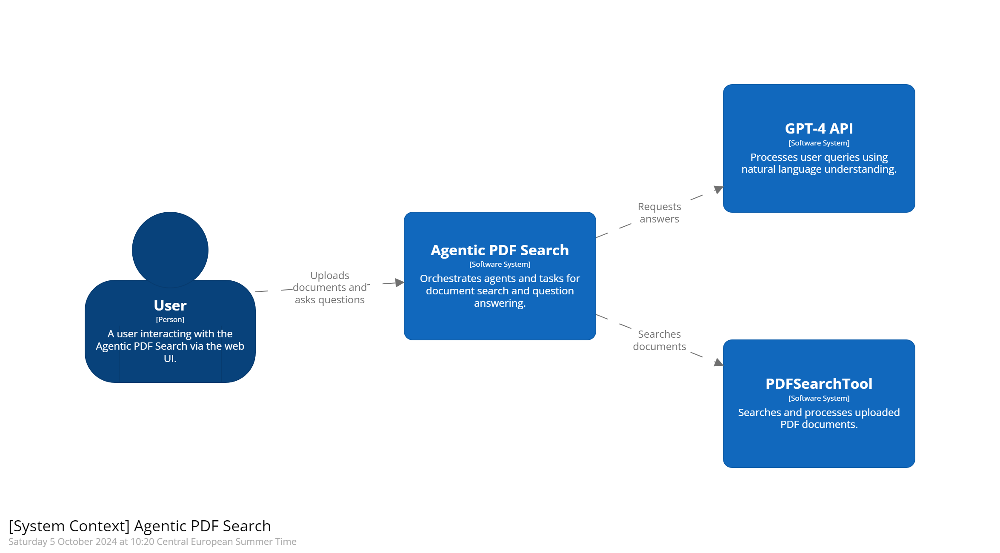
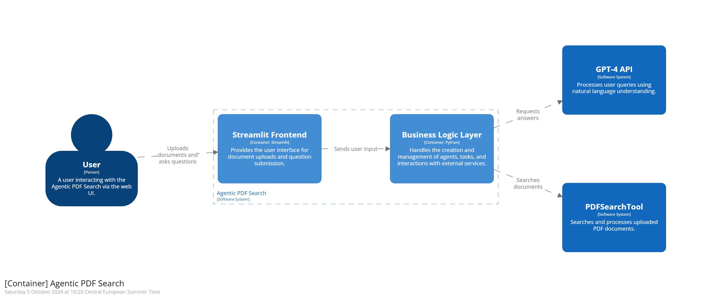

# Architecture Overview

## System Context Diagram
This diagram shows how the **Agentic PDF Search** interacts with external users and services.

## Container Diagram
This diagram breaks down the system into its main containers: the Streamlit Frontend, Business Logic Layer, and the external services (GPT-4 API, PDFSearchTool).

