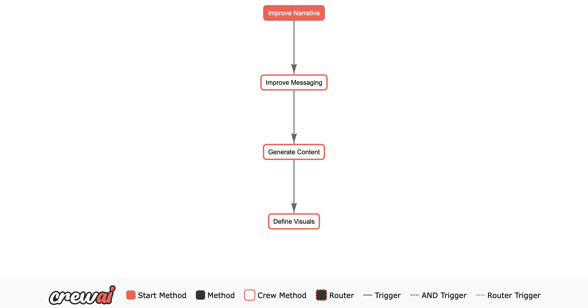

# 🤖 AI Brand Coach

**AI Brand Coach** is a storytelling and branding assistant powered by CrewAI, designed to help users craft compelling narratives, refine brand messaging, generate web content, and define consistent visual identity.

This assistant takes a general brand idea and guides the user through four structured phases:

1. Improve Narrative  
2. Improve Messaging  
3. Generate Content  
4. Define Visuals  

---

## 🔍 Overview

This project uses a modular and sequential crew-based workflow (powered by [CrewAI](https://github.com/joaomdmoura/crewAI)) to transform an abstract brand idea into a full-fledged brand story, complete with:

- Mission, vision, values  
- Refined messaging and slogans  
- Website-ready content  
- Visual branding guidelines  

### 🔁 Workflow Diagram



---

## 🧠 Architecture

### 1. `Improve Narrative`
**Crew:** `NarrativeCrew`  
**Agents:**  
- `narrative_researcher`
- `story_coach`
- `archetype_strategist`
- `narrative_editor`

**Tasks:**  
- `research_context`
- `elicitation_story`
- `framework_mapping`
- `editing_polish` (produces structured brand narrative output)

### 2. `Improve Messaging`
**Crew:** `MessagingCrew`  
**Agent:** `messaging_researcher`  
**Task:** `research_task` (outputs `refined_message`, `taglines`, and `slogans`)

### 3. `Generate Content`
**Crew:** `ContentCrew`  
**Agent:** `content_writer`  
**Task:** `generate_website_copy`

### 4. `Define Visuals`
**Crew:** `VisualCrew`  
**Agent:** `visual_designer`  
**Task:** `create_visual_guidelines`

---

## 🧩 Project Structure

```
.
├── crews/
│   ├── content_crew/
│   ├── messaging_crew/
│   ├── narrative_crew/
│   ├── visual_crew/
│   └── tools/
├── images/
│   └── flow_plot.png
├── main.py
├── README.md
```

---

## 🚀 Getting Started

### Prerequisites

- Python 3.10+
- Install dependencies:
```bash
pip install chainlit crewai pydantic
```

### Run the app

```bash
chainlit run main.py
```

Then open [http://localhost:8000](http://localhost:8000) in your browser.

---

## 🛠️ Human Feedback Tool

This project uses a tool named `HumanInputContextTool`, which allows agents to ask human follow-up questions mid-task via Chainlit UI.

```python
class HumanInputContextTool(BaseTool):
    name: str = "ask_user"
    ...
```

---

## 📌 Future Improvements

- Add multi-language support  
- Allow editing and revisiting phases  
- Export assets to PDF/image  

---

## 📃 License

MIT License
---

## 🧰 Tech Stack

- **[CrewAI](https://github.com/joaomdmoura/crewAI):** Agent orchestration and task delegation framework
- **[Chainlit](https://github.com/Chainlit/chainlit):** Interactive UI for LLM-based applications
- **Pydantic:** Data validation and structured output
- **Python 3.11**: Core programming language
- **Docker:** For containerized deployment
- **Poetry:** For dependency and environment management

---

## 📦 Installation with Poetry

This project uses [Poetry](https://python-poetry.org/) for package management and virtual environments.

### Step-by-step Setup

1. Install Poetry (if not already installed):

```bash
pip install poetry
```

2. Install dependencies:

```bash
poetry install
```

3. Run the Chainlit app:

```bash
poetry run chainlit run main.py
```

---

## 🐳 Docker Usage

You can run this project in a Docker container using the provided Dockerfile.

### Build and Run

```bash
docker build -t ai-brand-coach .
docker run -p 8000:8000 ai-brand-coach
```

Then access the app

---

# Credit and Contact

Special thanks to [Abdelrahman Khaled](https://github.com/Abdo404Khaled) for this valuable contribution. Connect with them on GitHub or LinkedIn for further discussion.