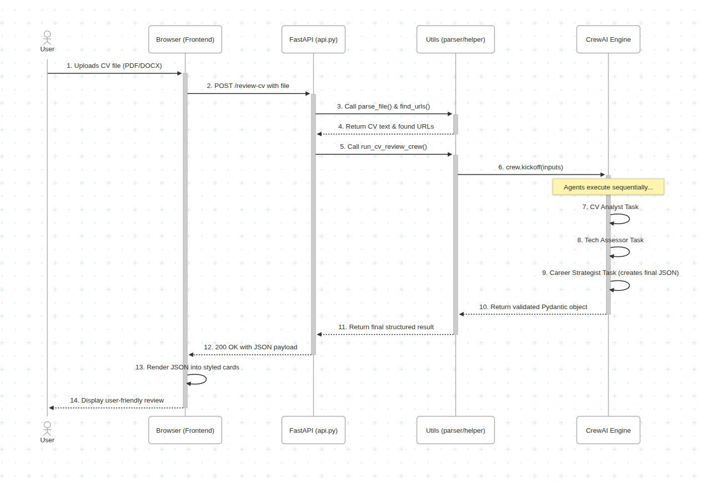

# AI CV Review Coach

An intelligent multi-agent system built with **CrewAI** and **FastAPI** that provides comprehensive, structured feedback on professional CVs. Users can upload a PDF or DOCX file and receive a detailed analysis, including an overall score, actionable suggestions, and relevant job role recommendations.

---


## ✨ Features

- **Direct File Upload**: Supports `.pdf` and `.docx` file formats for a seamless user experience.
- **Intelligent Tool Usage**: Automatically detects and analyzes GitHub links found within the CV text.
- **Structured AI Output**: Leverages Pydantic models to ensure the AI's response is always a consistent, structured JSON object.
- **User-Friendly Frontend**: A clean and responsive interface built with HTML and Tailwind CSS to display the analysis in an easy-to-digest format.
- **Robust Backend**: Built on FastAPI with a clean, modular architecture separating concerns (API, AI logic, utilities).
- **Containerized**: Fully containerized with Docker and Docker Compose for easy setup and deployment.

---

## 🖼️ Visuals and Demo

### Sequence Diagram

The following diagram illustrates the sequence of interactions within the system when a user uploads a CV for review. It shows how the frontend, backend API, and the CrewAI agents collaborate to process the request and generate feedback.



### Demo Video

Watch a quick walkthrough of the application and its features:

[AI CV Review Coach Demo](https://www.loom.com/share/17982e1dc1a64bd6b03ae91dfc38e958)

---

## 🛠️ Tech Stack

- **Backend**: FastAPI, Uvicorn
- **AI Framework**: CrewAI
- **File Parsing**: `pypdf`, `python-docx`
- **Frontend**: HTML, Tailwind CSS, JavaScript (`marked.js`)
- **Containerization**: Docker, Docker Compose

---

## 📂 Project Structure

The project follows a clean, modular architecture to separate concerns:

```

.
├── Dockerfile          # Defines the container for the application
├── requirements.txt    # Manages Python dependencies
├── static/
│   └── index.html      # The single-page frontend
└── src/
├── api.py          # FastAPI application, handles HTTP requests
├── cv_reviewer/    # The core CrewAI package
│   ├── config/     # YAML files for agents and tasks
│   ├── crew.py     # Assembles the crew from agents and tasks
│   └── tools/      # Custom tools for agents (e.g., GitHub tool)
├── schemas/
│   └── cv_output.py    # Pydantic model for structured AI output
└── utils/
├── agent_helper.py # Bridge between the API and the crew
└── file_parser.py  # Handles parsing of PDF/DOCX files

````

---

## 🌐 Try it Online!

You can try the AI CV Review Coach live at:

**[https://agenticaicoach-v279.onrender.com/](https://agenticaicoach-v279.onrender.com/)**

**Note:** The application is hosted on Render's free tier. If the app is inactive, it might take about 50 seconds to wake up on your first visit.

---

## 🚀 Getting Started (Docker)

Running the application with Docker is the recommended method.

### Prerequisites

- [Docker](https://www.docker.com/products/docker-desktop/) installed and running on your system.
- An OpenAI API key.

### Installation & Setup

1.  **Clone the Repository**
    ```bash
    git clone https://github.com/abdulmunimjemal/AgenticAICoach
    cd AgenticAICoach/community_submissions/cv_reviewer/
    ```

2.  **Create Environment File**
    Create a `.env` file in the project's root directory. Add your OpenAI API key to this file:
    ```
    OPENAI_API_KEY=sk-YourSecretApiKeyGoesHere
    MODEL=gpt-4O
    ```

    You can find a `.env.example` for this

3.  **Build and Run with Docker Compose**
    From the root directory, run the following command. This will build the Docker image and start the application.
    ```bash
    docker compose up --build
    ```

4.  **Access the Application**
    Once the container is running, open your web browser and navigate to:
    **[http://localhost:8000](http://localhost:8000)**
    
    You can check  **[http://localhost:8000/docs](http://localhost:8000/docs)** for API docs.

You can now upload a CV and receive your AI-powered review!

---

### 💻 Local Development (Without Docker)

If you prefer to run the application locally for development:

1.  **Create a virtual environment and activate it**:
    ```bash
    python3 -m venv .venv
    source .venv/bin/activate
    ```

2.  **Install Dependencies**:
    ```bash
    pip install -r requirements.txt
    ```

3.  **Create `.env` File**:
    As described in the Docker setup, create a `.env` file in the root directory with your `OPENAI_API_KEY`.

4.  **Run the FastAPI Server**:
    ```bash
    uvicorn src.api:app --reload
    ```

5.  **Access the Application**:
    The application will be available at **[http://localhost:8000](http://localhost:8000)**.
