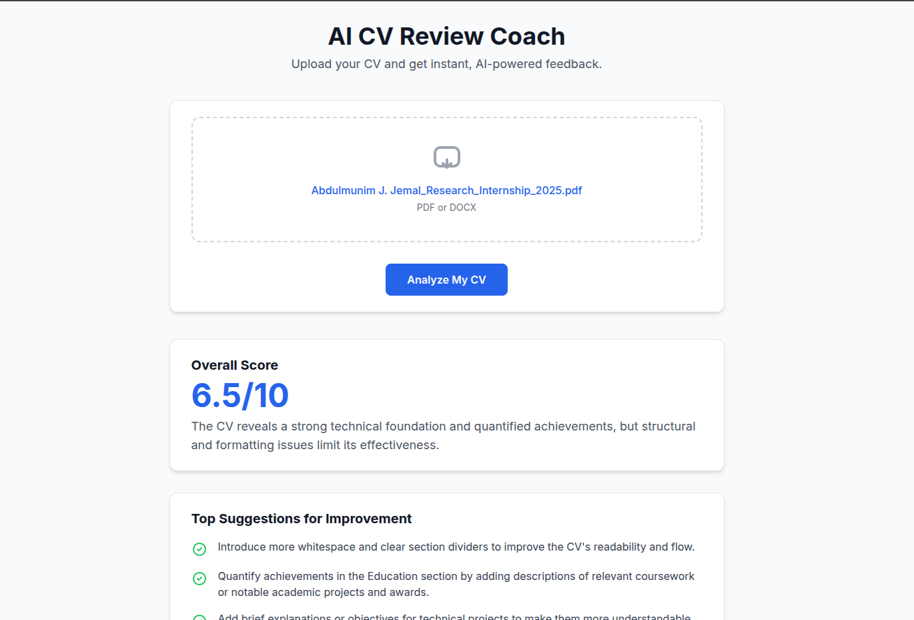
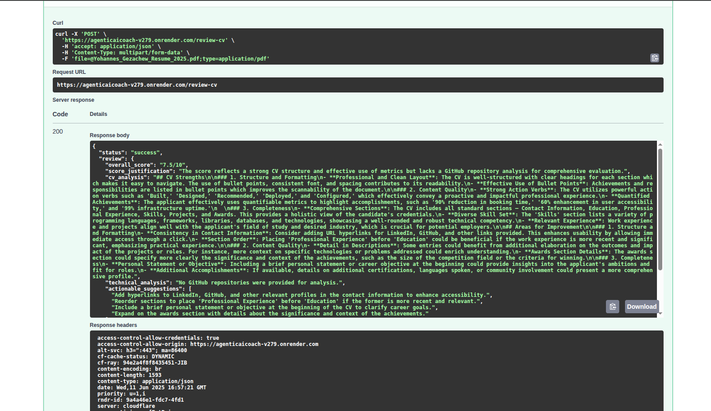

# AI CV Review Coach - Visual Documentation

This document provides visual insights into the AI CV Review Coach application, including its operational flow and user interface.

## Sequence Diagram

The following diagram illustrates the sequence of interactions within the system when a user uploads a CV for review. It shows how the frontend, backend API, and the CrewAI agents collaborate to process the request and generate feedback.

## Application Screenshots

These screenshots provide a glimpse into the user experience and the developer-facing API documentation.

### Main Web Interface

The primary user interface where a CV can be uploaded for analysis.

### API Documentation (Swagger UI)

The FastAPI backend automatically generates interactive API documentation.

**Overview of API Endpoints:**

**Details of the `/review-cv` Endpoint:**

## Demo Video

Watch a walkthrough of the application and its features:

[AI CV Review Coach Demo](https://www.loom.com/share/17982e1dc1a64bd6b03ae91dfc38e958)

---

For comprehensive details about the project, including setup, features, and tech stack, please refer to the main [README.md](../README.md).
